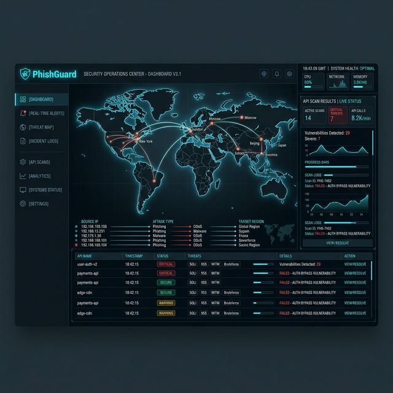

# 🛡️ PhishGuard - SOC Threat Intelligence Dashboard

> **"Trust No One. Verify Everything."**

<div align="center">

   

**PhishGuard** is an elite, next-generation cybersecurity dashboard designed for modern Security Operations Centers (SOCs). It fuses multi-layered heuristic analysis with the zero-latency reasoning of **Google's Gemini AI** to detect phishing attempts, dissect malicious URLs, and visualize global threats in real-time.



</div>

---

## 🔥 Elite Features

### 🔍 Advanced AI Phishing Detection
* **Multi-Layer Analysis**: Instant evaluation of URL structure, domain reputation, and SSL validity.
* **AI-Powered Verdicts**: Employs the Gemini 3 Flash model to interpret real-world social engineering contexts.
* **Confidence Scoring**: Precision risk scores (0-100%) augmented with actionable, explainable insights.
* **Red Flag Highlighting**: Rapidly identifies homograph attacks, typosquatting, and zero-day abuse.

### 🖥️ Professional SOC UI/UX
* **Dark Mode Aesthetic**: Enterprise-grade "Midnight Blue" and neon-cyan visual hierarchy designed out-of-the-box for low-light SOC environments.
* **Advanced Cyber Animations**: Dynamic radar sweeps, scan-line targeting, and glowing alerts.
* **Smart Paste Detection**: The system intelligently initiates a deep-scan the moment a URL is pasted into the window.

### 🌐 Live Threat Intelligence & Tools
* **Context-Aware Terminal Execution**: Specialized analysis with live CLI-style readout interfaces.
* **Global Feed**: Real-time simulated scrolling alerts of cyber attacks (SQLi, XSS, C2 Callbacks) across various industry sectors.
* **Developer Hub**: Built-in interactive API playground holding documentation for scalable integrations.

---

## 🚀 Installation & Setup

### Prerequisites
- Node.js (v18 or higher)
- npm or yarn
- A valid Google Gemini API Key

### 1. Clone the Repository
```bash
git clone https://github.com/saichandram/phishguard.git
cd phishguard
```

### 2. Install Dependencies
```bash
npm install
```

### 3. Configure Environment
The application requires a Google Gemini API key to function. 
*Note: In this demo environment, the key is accessed via `process.env.API_KEY`.*

### 4. Run Development Server
```bash
npm start
```
The application will launch at `http://localhost:1234` (or your configured port).

---

## 📖 Usage Guide

1. **Dashboard Scan**: 
   - Paste a suspicious URL (e.g., `http://secure-login-update.com`) into the main search bar.
   - The system detects the paste and automatically triggers the scan with a visual "scan line" effect.
   - Review the **Risk Level**, **Confidence Score**, and **SOC Analyst Explanation**.

2. **Deep Dive**:
   - Navigate to the **"Analysis Tools"** tab.
   - Select a tool (e.g., *SSL Decoder*) to view its specific capabilities in the description banner before execution.

3. **Monitor**:
   - Keep the **"Live Feed"** open on a secondary monitor to simulate a Security Operations Center environment.

---

## 📦 Deployment

This project is built with React and Vite/Parcel, making it easy to deploy on modern frontend platforms.

### Vercel
1. Install Vercel CLI: `npm i -g vercel`
2. Run `vercel` inside the project folder.
3. Ensure your `API_KEY` is added to Vercel's Environment Variables.

### Netlify
1. Run `npm run build`.
2. Deploy the `dist` folder.

---

## 👨‍💻 Credits

**Developed by Saichandram**

> "Building the future of secure interfaces."

---

## 📄 License

This project is licensed under the MIT License - see the LICENSE file for details.